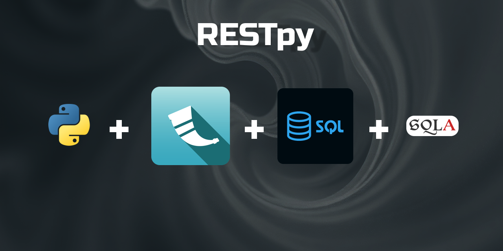

This is a Sandbox project, because it perfectly represents a space for experimentation and trying out new ideas without the pressure to reach perfection. Just like a real sandbox, it’s a place to build, break, and rebuild. These projects are not production-ready or polished; they’re meant to be hands-on exercises that help me forge fundamentals and improve my skills in a practical way. For me growth happens through trial and error.

**RESTpy** is a project i made to learn the fundamentals of building REST APIs. It was developed using Python's Flask framework, which is easy to learn. 

For database management, I used SQLAlchemy, a powerful SQL toolkit and Object-Relational Mapper (ORM) that simplifies interactions with the database.

This project served as a hands-on introduction to core concepts of APIs and the Python language.
